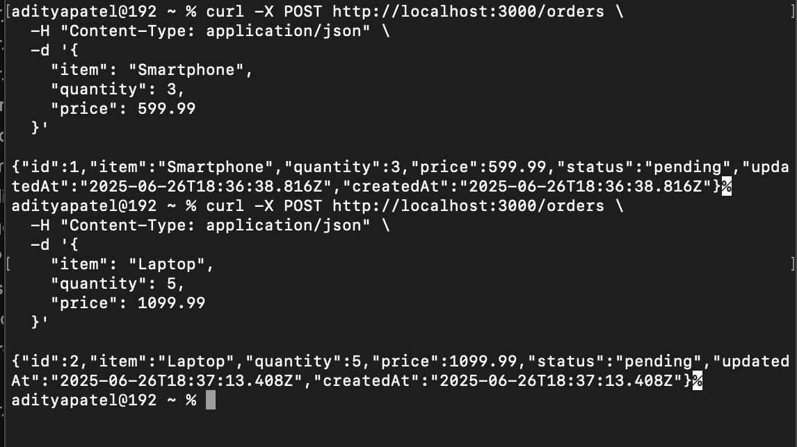

# Distributed Order Processing System

## Overview

This project simulates an **e-commerce-style distributed system** that decouples order creation, processing, and status management. Using Redis as a queue, orders are processed asynchronously by a Go service, with inter-service communication via gRPC to ensure scalable, event-driven architecture.

---

## Impact

* Mimics **real-world backend systems** used in online marketplaces and retail platforms.
* Demonstrates **asynchronous communication and processing** using a message queue (Redis).
* Provides hands-on understanding of **gRPC**, microservices, and inter-language service orchestration (Node.js ↔ Go).
* Highlights efficient **status transition workflows** (`pending` → `processing` → `completed`) in distributed environments.

---

## Functionalities

* **Create Orders** via REST API (`POST /orders`)
* **Push to Redis Queue** with essential data (`orderId`, `quantity`)
* **Process Orders** asynchronously using Go service
* **Update Status via gRPC** to `processing` and later `completed`
* **View All Orders** using REST (`GET /orders`)
* **MySQL Persistence** for order lifecycle tracking

---

## Technologies Used

| Category         | Technology             |
| ---------------- | ---------------------- |
| API Layer        | Node.js, Express       |
| Database         | MySQL                  |
| Message Queue            | Redis          |
| Worker Service   | Go                     |
| Communication    | gRPC, RESTful|
| Containerization | Docker |

---

## Highlights

* Asynchronous queue-based processing with Redis
* Microservice architecture: loose coupling and high cohesion
* Language-agnostic gRPC interface between Go and Node.js
* Sequelize `sync()` ensures schema alignment without migrations
* Retries and health checks ensure robust startup via Docker Compose
* Modular codebase with separation of concerns (controllers, models, services)

---

## Commands to Run the Project

> Make sure Docker and Docker Compose are installed.

```bash
# Step 1: Clone the repo
git clone https://github.com/your-username/distributed-order-system.git
cd distributed-order-system

# Step 2: Start all services
docker-compose up --build
```

You should see:

* REST API on [http://localhost:3000](http://localhost:3000)
* gRPC running on port `50051`

---

## Output Screenshots

<<<<<<< HEAD



=======


>>>>>>> acbffd684543b62d71f316fae01a979109d70827

---

## Sample Commands

### Create an Order

```bash
curl -X POST http://localhost:3000/orders \
  -H "Content-Type: application/json" \
  -d '{
    "item": "Laptop",
    "quantity": 2,
    "price": 1299.99
  }'
```

### Get All Orders

```bash
curl http://localhost:3000/orders
```

---

## Notes

* The Redis queue only stores `orderId` and `quantity` for efficiency.
* Statuses (`pending`, `processing`, `completed`) are updated in MySQL through Sequelize.
* gRPC services are defined in `.proto` files and loaded using `@grpc/proto-loader`.
* Retry mechanisms ensure the Node service waits for MySQL and Redis before starting.
* The system is extensible to include features like email notifications, billing, etc.
